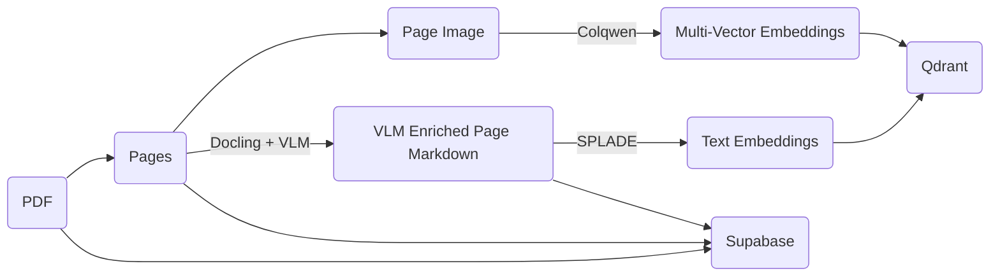
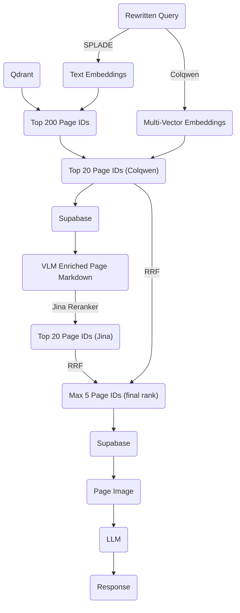

# Multimodal-RAG
## Ingestion

```mermaid
flowchart LR
A(PDF) --> B(Pages)
B --> C(Page Image)
C -->|Colqwen| E(Multi-Vector Embeddings)
E --> F(Qdrant)
B-->|Docling + VLM| H(VLM Enriched Page Markdown)
H --> |SPLADE| I(Text Embeddings)
I --> F
A --> J(Supabase)
B --> J
H --> J

```

## Retrieval and Generation

```mermaid
flowchart TD
A(Rewritten Query) --> |SPLADE| B(Text Embeddings)
A --> |Colqwen| C(Multi-Vector Embeddings)
E(Qdrant) --> F(Top 200 Page IDs)
B --> F
F --> G("Top 20 Page IDs (Colqwen)")
C --> G
G --> H(Supabase) 
H --> I(VLM Enriched Page Markdown)
I -->|Jina Reranker| K("Top 20 Page IDs (Jina)")
K --> |RRF| L("Max 5 Page IDs (final rank)")
G --> |RRF| L
L --> M(Supabase)
M --> N(Page Image)
N --> O(LLM)
O --> P(Response)

```

